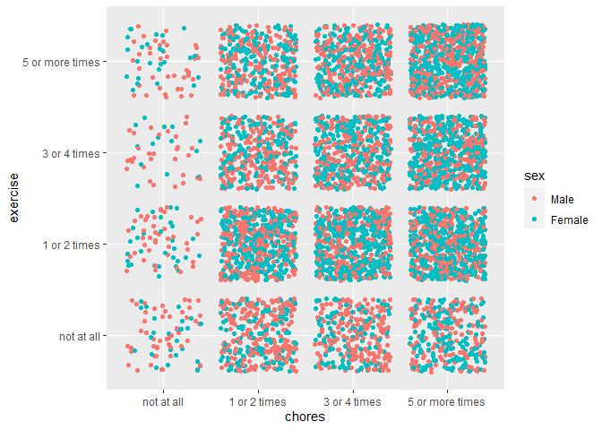

```{=html}
<div id="htmlwidget-d204a8f5e6002b8b8bb0" style="width:100%;height:auto;" class="datatables html-widget"></div>
<script type="application/json" data-for="htmlwidget-d204a8f5e6002b8b8bb0">{"x":{"filter":"none","vertical":false,"data":[["1","2","3","4"],["sex","chores","active_sport","exercise"]],"container":"<table class=\"display\">\n  <thead>\n    <tr>\n      <th> <\/th>\n      <th>varname<\/th>\n    <\/tr>\n  <\/thead>\n<\/table>","options":{"order":[],"autoWidth":false,"orderClasses":false,"columnDefs":[{"orderable":false,"targets":0}]}},"evals":[],"jsHooks":[]}</script>
```

<table class=" lightable-classic" style='font-family: "Arial Narrow", "Source Sans Pro", sans-serif; width: auto !important; margin-left: auto; margin-right: auto;'>
 <thead>
  <tr>
   <th style="text-align:left;"> sex </th>
   <th style="text-align:right;"> n </th>
   <th style="text-align:right;"> pct </th>
  </tr>
 </thead>
<tbody>
  <tr>
   <td style="text-align:left;"> Male </td>
   <td style="text-align:right;"> 3143 </td>
   <td style="text-align:right;"> 48 </td>
  </tr>
  <tr>
   <td style="text-align:left;"> Female </td>
   <td style="text-align:right;"> 3353 </td>
   <td style="text-align:right;"> 52 </td>
  </tr>
</tbody>
</table>
<table class=" lightable-classic" style='font-family: "Arial Narrow", "Source Sans Pro", sans-serif; width: auto !important; margin-left: auto; margin-right: auto;'>
 <thead>
  <tr>
   <th style="text-align:left;"> chores </th>
   <th style="text-align:right;"> n </th>
   <th style="text-align:right;"> pct </th>
  </tr>
 </thead>
<tbody>
  <tr>
   <td style="text-align:left;"> not at all </td>
   <td style="text-align:right;"> 255 </td>
   <td style="text-align:right;"> 4 </td>
  </tr>
  <tr>
   <td style="text-align:left;"> 1 or 2 times </td>
   <td style="text-align:right;"> 1759 </td>
   <td style="text-align:right;"> 27 </td>
  </tr>
  <tr>
   <td style="text-align:left;"> 3 or 4 times </td>
   <td style="text-align:right;"> 2016 </td>
   <td style="text-align:right;"> 31 </td>
  </tr>
  <tr>
   <td style="text-align:left;"> 5 or more times </td>
   <td style="text-align:right;"> 2466 </td>
   <td style="text-align:right;"> 38 </td>
  </tr>
</tbody>
</table>


<table class=" lightable-classic" style='font-family: "Arial Narrow", "Source Sans Pro", sans-serif; width: auto !important; margin-left: auto; margin-right: auto;'>
 <thead>
  <tr>
   <th style="text-align:left;"> active_sport </th>
   <th style="text-align:right;"> n </th>
   <th style="text-align:right;"> pct </th>
  </tr>
 </thead>
<tbody>
  <tr>
   <td style="text-align:left;"> not at all </td>
   <td style="text-align:right;"> 1908 </td>
   <td style="text-align:right;"> 29 </td>
  </tr>
  <tr>
   <td style="text-align:left;"> 1 or 2 times </td>
   <td style="text-align:right;"> 1785 </td>
   <td style="text-align:right;"> 27 </td>
  </tr>
  <tr>
   <td style="text-align:left;"> 3 or 4 times </td>
   <td style="text-align:right;"> 1221 </td>
   <td style="text-align:right;"> 19 </td>
  </tr>
  <tr>
   <td style="text-align:left;"> 5 or more times </td>
   <td style="text-align:right;"> 1582 </td>
   <td style="text-align:right;"> 24 </td>
  </tr>
</tbody>
</table>

<table class=" lightable-classic" style='font-family: "Arial Narrow", "Source Sans Pro", sans-serif; width: auto !important; margin-left: auto; margin-right: auto;'>
 <thead>
  <tr>
   <th style="text-align:left;"> exercise </th>
   <th style="text-align:right;"> n </th>
   <th style="text-align:right;"> pct </th>
  </tr>
 </thead>
<tbody>
  <tr>
   <td style="text-align:left;"> not at all </td>
   <td style="text-align:right;"> 1070 </td>
   <td style="text-align:right;"> 16 </td>
  </tr>
  <tr>
   <td style="text-align:left;"> 1 or 2 times </td>
   <td style="text-align:right;"> 2059 </td>
   <td style="text-align:right;"> 32 </td>
  </tr>
  <tr>
   <td style="text-align:left;"> 3 or 4 times </td>
   <td style="text-align:right;"> 1618 </td>
   <td style="text-align:right;"> 25 </td>
  </tr>
  <tr>
   <td style="text-align:left;"> 5 or more times </td>
   <td style="text-align:right;"> 1749 </td>
   <td style="text-align:right;"> 27 </td>
  </tr>
</tbody>
</table>


```
## `summarise()` has grouped output by 'sex'. You can override using the `.groups` argument.
```

<table class=" lightable-classic" style='font-family: "Arial Narrow", "Source Sans Pro", sans-serif; width: auto !important; margin-left: auto; margin-right: auto;'>
 <thead>
  <tr>
   <th style="text-align:left;"> sex </th>
   <th style="text-align:left;"> chores </th>
   <th style="text-align:right;"> n </th>
   <th style="text-align:right;"> pct </th>
  </tr>
 </thead>
<tbody>
  <tr>
   <td style="text-align:left;"> Male </td>
   <td style="text-align:left;"> not at all </td>
   <td style="text-align:right;"> 159 </td>
   <td style="text-align:right;"> 5 </td>
  </tr>
  <tr>
   <td style="text-align:left;"> Male </td>
   <td style="text-align:left;"> 1 or 2 times </td>
   <td style="text-align:right;"> 959 </td>
   <td style="text-align:right;"> 31 </td>
  </tr>
  <tr>
   <td style="text-align:left;"> Male </td>
   <td style="text-align:left;"> 3 or 4 times </td>
   <td style="text-align:right;"> 995 </td>
   <td style="text-align:right;"> 32 </td>
  </tr>
  <tr>
   <td style="text-align:left;"> Male </td>
   <td style="text-align:left;"> 5 or more times </td>
   <td style="text-align:right;"> 1030 </td>
   <td style="text-align:right;"> 33 </td>
  </tr>
  <tr>
   <td style="text-align:left;"> Female </td>
   <td style="text-align:left;"> not at all </td>
   <td style="text-align:right;"> 96 </td>
   <td style="text-align:right;"> 3 </td>
  </tr>
  <tr>
   <td style="text-align:left;"> Female </td>
   <td style="text-align:left;"> 1 or 2 times </td>
   <td style="text-align:right;"> 800 </td>
   <td style="text-align:right;"> 24 </td>
  </tr>
</tbody>
</table>

<!-- -->

## Code Appendix


```r
### Setting up the packages, options we'll need:
library(knitr)
knitr::opts_chunk$set(echo = FALSE)
library(tidyverse)
library(curl)
library(haven)
library(DT)
# download and unzip the larger Add Health data set
myUrl <- "http://staff.washington.edu/phurvitz/csde502_winter_2021/data/21600-0001-Data.dta.zip"

# zip file in $temp -- basename gets just the file name from the URL and not the URL path;
#   file.path stitches the tempdir() path to the file name
zipfile <- file.path(tempdir(), basename(myUrl))

# dta file in $temp
dtafile <- tools::file_path_sans_ext(zipfile)

# check if the dta file exists
if (!file.exists(dtafile)) {
    # if the dta file doesn't exist, check for the zip file
    # check if the zip file exists, download if necessary
    if (!file.exists(zipfile)) {
        curl::curl_download(url = myUrl, destfile = zipfile)
    }
    # unzip the downloaded zip file
    if (file.exists(zipfile)) {
        unzip(zipfile = zipfile, exdir = tempdir())
    }
}

# if the data set has not been read, read it in
if (!exists("ahcomplete")) {
    ahcomplete <- haven::read_dta(dtafile)
}

# make the data frame 
ah_subset <- ahcomplete %>%
    # select columns
    select(
        sex = BIO_SEX,
        chores = H1DA1,
        active_sport = H1DA5,
        exercise = H1DA6
    ) %>%
    # filter for valid values
    filter(sex <= 2 & chores <= 3 & active_sport <= 3 & exercise <= 3)

#make columns factors
ah_subset$sex <- as.factor(ah_subset$sex)
ah_subset$chores <- as.factor(ah_subset$chores)
ah_subset$active_sport <- as.factor(ah_subset$active_sport)
ah_subset$exercise <- as.factor(ah_subset$exercise)

#label overall data frame
attributes(ah_subset)$label <- "National Longitudinal Study of Adolescent to Adult Health (Add Health), 1994-2000, subset"

# create a data frame of the variable names and labels
ahsubset_metadata <- bind_cols(
    varname = colnames(ah_subset),
    varlabel = ah_subset %>% map(~ attributes(.)$label) %>% unlist()
)
# print the table with DT::datatable for interactive display
DT::datatable(ahsubset_metadata)

#save the data set as an RDS file
saveRDS(object = ah_subset, file = file.path(tempdir(), "ah_subset.RDS"))

#variables as factors
ah_subset$sex <- factor(ah_subset$sex, levels = c(1, 2), labels = c("Male", "Female"))
ah_subset$chores <- factor(ah_subset$chores, levels = c(0, 1, 2, 3), labels = c("not at all", "1 or 2 times", "3 or 4 times", "5 or more times"))
ah_subset$active_sport <- factor(ah_subset$active_sport, levels = c(0, 1, 2, 3), labels = c("not at all", "1 or 2 times", "3 or 4 times", "5 or more times"))
ah_subset$exercise <- factor(ah_subset$exercise, levels = c(0, 1, 2, 3), labels = c("not at all", "1 or 2 times", "3 or 4 times", "5 or more times"))
#create a frequency table for each variable with count and percentage
tab_sex <- ah_subset %>% 
    group_by(sex) %>%
    summarise(n = n()) %>% mutate(pct = round((n/sum(n))*100, 0))
tab_sex %>%
  head() %>%
  knitr::kable() %>%
  kableExtra::kable_classic(full_width = FALSE)
tab_chores <- ah_subset %>% 
    group_by(chores) %>%
    summarise(n = n()) %>% mutate(pct = round((n/sum(n))*100, 0))
tab_chores %>%
  head() %>%
  knitr::kable() %>%
  kableExtra::kable_classic(full_width = FALSE)
tab_activesport <- ah_subset %>% 
    group_by(active_sport) %>%
    summarise(n = n()) %>% mutate(pct = round((n/sum(n))*100, 0))
tab_activesport %>%
  head() %>%
  knitr::kable() %>%
  kableExtra::kable_classic(full_width = FALSE)
tab_exercise <- ah_subset %>% 
    group_by(exercise) %>%
    summarise(n = n()) %>% mutate(pct = round((n/sum(n))*100, 0))
tab_exercise %>%
  head() %>%
  knitr::kable() %>%
  kableExtra::kable_classic(full_width = FALSE)
#create a frequency table with two variables
tab_sex_chores <- ah_subset %>% 
  group_by(sex, chores) %>% 
  summarise(n = n()) %>% mutate(pct = round((n/sum(n))*100, 0))
tab_sex_chores %>%
  head() %>%
  knitr::kable() %>%
  kableExtra::kable_classic(full_width = FALSE)
ggplot(ah_subset, aes(chores, exercise, color = sex)) + geom_jitter()
```
